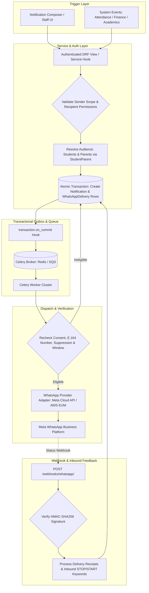
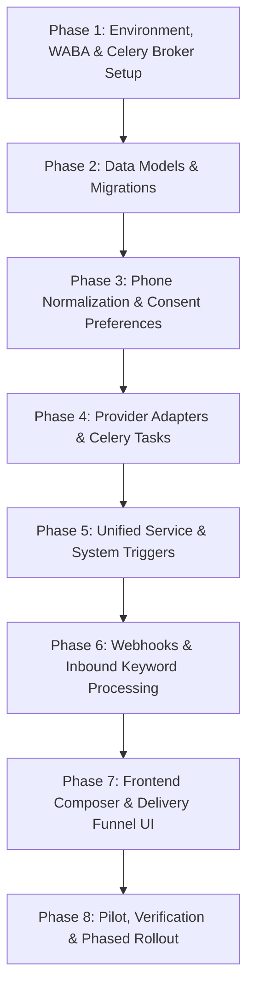

# Implementation Plan: WhatsApp Delivery for CRM Notifications

**Status:** Draft for Implementation — Enhanced Architecture  
**Target Systems:** `institute_crm/communications/`, `institute_crm/accounts/`, `institute_crm/users_profiles/`, `institute_crm/frontend/`  
**Related Documents:** `MOBILE_CRM_IMPLEMENTATION_PLAN.md`, `AWS_DEPLOYMENT_GUIDE.md`, `requirements.txt`

---

## 1. Goal & Product Scope

When an authorized user creates a notification or when the CRM triggers an automated system event, create the in-app notification row and asynchronously deliver a WhatsApp message to each selected recipient (**Student**, **Parent**, or **Both**) who has a valid phone number and explicit, auditable consent. Show the sender real-time recipient counts, delivery funnels, and failure diagnostics, and provide authorized staff with an audit trail and retry controls.

### Covered Notification Channels & Triggers
1. **Manual Batch Notifications:** Broadcasts sent from the staff portal to specific batches, classes, or selected students/parents.
2. **Announcements:** Institute-wide or branch-wide broadcasts published to designated audiences.
3. **Direct Staff Composers:** Individual student/parent direct notifications sent by teachers, counselors, or branch admins.
4. **System-Generated Event Triggers:** Automated transactional alerts:
   - **Attendance:** Instant alert to parents when a student is marked Absent or Tardy.
   - **Finance:** Fee due reminders, installment payment links, and automated payment receipts.
   - **Academics:** Lecture rescheduling, room changes, exam schedule releases, and report card publishing.
   - **CRM Leads:** Instant demo lecture confirmations and counselor follow-up messages.

All channels and triggers must route through a single server-side dispatch service (`CommunicationService.create_notification_campaign`). No raw API calls or direct database inserts may bypass recipient validation, sender scoping, rate limits, or WhatsApp consent verification.

---

## 2. Current Application Findings & Technical Audit

A review of the `institute_crm` codebase reveals the following existing state:

1. **Framework & Architecture:** Django 5.0 with Django REST Framework (DRF), PostgreSQL, and modular domain apps. Communications reside in `institute_crm/communications/` mounted at `/api/v1/communications/`.
2. **Current Notification Model:** `Notification` in `communications/models.py` represents a single row per recipient. It records `recipient` (`User`), optional `sender`, `batch`, `target_audience` (`STUDENTS`, `PARENTS`, `ALL`), `title`, `message`, `channel` (`IN_APP`, `SMS`, `EMAIL`, `ALL`), and boolean `is_read`.
3. **Audience Resolution:** `CommunicationService.send_batch_notification()` resolves students from active `CourseEnrolment` rows. When `target_audience` is `PARENTS` or `ALL`, it queries `users_profiles.models.StudentParent` to resolve linked parent user accounts. This dual-audience logic must be preserved for WhatsApp.
4. **Role Permissions & Scoping:** Batch sending is restricted to `SUPER_ADMIN`, `BRANCH_ADMIN` (restricted to their branch batches), and `TEACHER` (restricted to batches they teach via `academics.models.Timetable`).
5. **Mobile Push Precedent:** `DeviceToken` was recently added in `communications/models.py` with device registration endpoints, showing multi-channel notification evolution.
6. **Phone Number State:** `User.phone` in `accounts/models.py` is an unnormalized `CharField(max_length=20)`. There is currently no E.164 normalization, no distinction between primary phone and WhatsApp phone, and no auditable opt-in/opt-out consent tracking.
7. **Task Queue Gap:** `requirements.txt` notes that Celery and Redis were intentionally deferred until background tasks were required (noted in lines 52–54 for RAG). Network calls to WhatsApp APIs must **never** run synchronously in the web request cycle (which currently happens for SES/SNS in `send_batch_notification()`). Introducing WhatsApp requires formalizing the Celery worker queue.
8. **Announcement Gap:** `publish_announcement()` currently sends to a hardcoded email (`all-students@institute.com`) without creating per-recipient notification rows or resolving student/parent profiles.

---

## 3. Recommended Design & Core Principles



### Core Architectural Principles
1. **Per-Recipient Tracking with Parent Awareness:** Keep `Notification` as the unified in-app record. Link each notification to a `WhatsAppDelivery` record containing the exact phone snapshot, template payload, provider message ID, and delivery lifecycle. Support both Student and Parent recipients.
2. **Provider Agnostic Boundary:** Implement a clean `WhatsAppProviderInterface` separating domain logic from provider APIs. Ship three provider adapters:
   - `MetaCloudApiProvider` (Standard direct Meta Graph API).
   - `AwsSocialMessagingProvider` (AWS End User Messaging Social).
   - `MockWhatsAppProvider` (Local development, CI, and end-to-end testing with zero billing and simulated callbacks).
3. **Template-First Design (Meta Compliance):** WhatsApp Business Platform strictly mandates approved pre-registered templates for business-initiated conversations outside the 24-hour customer-care window. Free-form text is only permitted within 24 hours of an inbound message. All outbound institute notices must be mapped to approved templates with structured parameters.
4. **Asynchronous Durability & Transactional Safety:** Enqueue message dispatch tasks exclusively via `transaction.on_commit()` after database rows are committed, preventing race conditions where workers fail to find uncommitted delivery rows.
5. **Idempotent Delivery & State Machine:** Enforce an idempotent delivery flow with unique idempotency keys per message attempt. Prevent status degradation from out-of-order webhook delivery (e.g., `DELIVERED` must never overwrite `READ`).
6. **Two-Way Messaging & Compliance:** Handle inbound webhooks for delivery receipts (`sent`, `delivered`, `read`, `failed`) and process opt-out keywords (`STOP`, `UNSUBSCRIBE`) automatically to comply with Meta opt-in policies.

---

## 4. Database Schema & Data Models

### 4.1 WhatsApp Consent & Preference Model (`accounts` / `communications`)

```python
class WhatsAppPreference(BaseModel):
    """Auditable WhatsApp consent, phone preferences, and suppression status."""

    CONSENT_SOURCE_CHOICES = [
        ('ADMISSION_FORM', 'Admission Form / Agreement'),
        ('STUDENT_PORTAL', 'Self-service Portal / App'),
        ('STAFF_ENTRY', 'Staff Administrative Entry'),
        ('INBOUND_MSG', 'Inbound WhatsApp Message (Opt-in)'),
    ]

    user = models.OneToOneField(
        settings.AUTH_USER_MODEL,
        on_delete=models.CASCADE,
        related_name='whatsapp_preference'
    )
    whatsapp_phone = models.CharField(
        max_length=20,
        blank=True,
        null=True,
        db_index=True,
        help_text="E.164 formatted WhatsApp number (e.g. +919876543210)"
    )
    is_whatsapp_verified = models.BooleanField(default=False)
    opt_in_transactional = models.BooleanField(
        default=True,
        help_text="Consent for academic, fee, and operational alerts"
    )
    opt_in_marketing = models.BooleanField(
        default=False,
        help_text="Consent for promotional workshops, courses, and offers"
    )
    consent_source = models.CharField(
        max_length=30,
        choices=CONSENT_SOURCE_CHOICES,
        default='ADMISSION_FORM'
    )
    consent_timestamp = models.DateTimeField(auto_now_add=True)
    consent_ip_address = models.GenericIPAddressField(null=True, blank=True)
    
    # Opt-out suppression
    opted_out_at = models.DateTimeField(null=True, blank=True, db_index=True)
    opt_out_reason = models.CharField(max_length=255, null=True, blank=True)

    @property
    def is_eligible_transactional(self) -> bool:
        return bool(
            self.whatsapp_phone and 
            self.opt_in_transactional and 
            self.opted_out_at is None
        )
```

### 4.2 Approved WhatsApp Template Registry (`communications`)

```python
class WhatsAppTemplate(BaseModel):
    """Registry of pre-approved Meta WhatsApp message templates."""

    CATEGORY_CHOICES = [
        ('UTILITY', 'Utility (Class alerts, fees, attendance)'),
        ('MARKETING', 'Marketing (Promotions, new courses)'),
        ('AUTHENTICATION', 'Authentication (OTPs, password resets)'),
    ]

    HEADER_TYPE_CHOICES = [
        ('NONE', 'None'),
        ('TEXT', 'Text Header'),
        ('DOCUMENT', 'PDF Document (Receipts, Reports)'),
        ('IMAGE', 'Image (Schedules, Notices)'),
    ]

    template_key = models.CharField(
        max_length=60,
        unique=True,
        help_text="Internal key e.g. BATCH_RESCHEDULED, FEE_DUE_REMINDER, STUDENT_ABSENT"
    )
    meta_template_name = models.CharField(
        max_length=120,
        help_text="Exact template name approved in Meta WhatsApp Business Manager"
    )
    category = models.CharField(max_length=20, choices=CATEGORY_CHOICES, default='UTILITY')
    language_code = models.CharField(max_length=10, default='en_US')
    header_type = models.CharField(max_length=20, choices=HEADER_TYPE_CHOICES, default='NONE')
    body_text_sample = models.TextField(help_text="Sample text showing {{1}}, {{2}} placeholders")
    parameter_schema = models.JSONField(
        default=list,
        help_text="List of parameter definitions e.g. [{'index': 1, 'name': 'student_name'}]"
    )
    is_active = models.BooleanField(default=True, db_index=True)
```

### 4.3 WhatsApp Delivery Tracking Model (`communications`)

```python
class WhatsAppDelivery(BaseModel):
    """Per-recipient WhatsApp dispatch state, provider IDs, and audit log."""

    STATUS_CHOICES = [
        ('PENDING', 'Pending Enqueue'),
        ('QUEUED', 'Queued in Worker'),
        ('SUBMITTED', 'Submitted to Meta'),
        ('SENT', 'Sent (Carrier Accepted)'),
        ('DELIVERED', 'Delivered to Handset'),
        ('READ', 'Read by Recipient'),
        ('FAILED', 'Delivery Failed'),
        ('SKIPPED', 'Skipped (No number / No consent / Opted out)'),
        ('OPTED_OUT', 'Suppressed (User previously opted out)'),
    ]

    RECIPIENT_ROLE_CHOICES = [
        ('STUDENT', 'Student'),
        ('PARENT', 'Parent'),
        ('STAFF', 'Staff'),
    ]

    notification = models.ForeignKey(
        'communications.Notification',
        on_delete=models.CASCADE,
        related_name='whatsapp_deliveries'
    )
    recipient = models.ForeignKey(
        settings.AUTH_USER_MODEL,
        on_delete=models.CASCADE,
        related_name='whatsapp_receipts'
    )
    recipient_role = models.CharField(max_length=20, choices=RECIPIENT_ROLE_CHOICES, default='STUDENT')
    phone_snapshot = models.CharField(
        max_length=20,
        help_text="Masked E.164 phone snapshot at dispatch time"
    )
    template = models.ForeignKey(
        WhatsAppTemplate,
        on_delete=models.SET_NULL,
        null=True,
        blank=True
    )
    template_name = models.CharField(max_length=120)
    template_parameters = models.JSONField(default=dict)
    header_media_url = models.URLField(max_length=500, blank=True, null=True)

    provider = models.CharField(max_length=30, default='META_CLOUD')
    provider_message_id = models.CharField(max_length=128, blank=True, null=True, db_index=True)
    status = models.CharField(max_length=20, choices=STATUS_CHOICES, default='PENDING', db_index=True)
    
    error_code = models.CharField(max_length=50, blank=True, null=True)
    error_message = models.TextField(blank=True, null=True)
    attempt_count = models.PositiveSmallIntegerField(default=0)
    
    # Financial / Category tracking
    pricing_category = models.CharField(max_length=30, blank=True, null=True)
    estimated_cost = models.DecimalField(max_digits=6, decimal_places=4, default=0.0000)

    # Lifecycle Timestamps
    sent_at = models.DateTimeField(null=True, blank=True)
    delivered_at = models.DateTimeField(null=True, blank=True)
    read_at = models.DateTimeField(null=True, blank=True)
    failed_at = models.DateTimeField(null=True, blank=True)
    
    idempotency_key = models.UUIDField(default=uuid.uuid4, unique=True, editable=False)

    class Meta:
        indexes = [
            models.Index(fields=['status', 'created_at'], name='wa_delivery_status_idx'),
            models.Index(fields=['recipient', 'status'], name='wa_delivery_recip_status_idx'),
        ]
```

---

## 5. Provider Abstraction & Meta Cloud API Specifications

### 5.1 Provider Interface (`communications/infrastructure/whatsapp/`)

```python
class WhatsAppProviderInterface(ABC):
    @abstractmethod
    def send_template_message(
        self,
        to_phone: str,
        template_name: str,
        language_code: str,
        parameters: list[dict],
        header_media_url: str | None = None,
        idempotency_key: str | None = None,
    ) -> ProviderSendResult:
        """Submits a template message to WhatsApp."""
        pass

    @abstractmethod
    def send_session_text(
        self,
        to_phone: str,
        text: str,
        idempotency_key: str | None = None,
    ) -> ProviderSendResult:
        """Sends free-form text within an open 24h customer care window."""
        pass

    @abstractmethod
    def verify_webhook_signature(
        self,
        raw_body: bytes,
        signature_header: str,
    ) -> bool:
        """Validates HMAC-SHA256 signature using App Secret."""
        pass

    @abstractmethod
    def parse_webhook_payload(self, payload: dict) -> list[WebhookEvent]:
        """Normalizes provider status receipts and inbound user messages."""
        pass
```

### 5.2 Provider Implementations
1. **`MetaCloudApiProvider`:** Direct HTTPS calls to Meta Graph API `https://graph.facebook.com/v19.0/{phone_number_id}/messages`. Sends JSON with `messaging_product="whatsapp"`, bearer token authentication, and template components (`HEADER`, `BODY`, `BUTTONS`).
2. **`AwsSocialMessagingProvider`:** Uses AWS Boto3 `socialmessaging` client for organizations consolidating communications under AWS alongside SES and SNS.
3. **`MockWhatsAppProvider`:** Local/testing provider. Validates payload schemas and regex phone patterns, writes dispatched payloads to local logs, records `wamid.MOCK_<uuid>`, and exposes an endpoint to simulate delivery and read callbacks.

---

## 6. Asynchronous Queue Architecture & Celery Worker Integration

### 6.1 Worker Configuration
To maintain system responsiveness and handle network latency, rate limits, and burst notifications:
- Adopt **Celery + Redis** (configured alongside RAG requirements).
- On AWS ECS: Celery workers communicate via AWS ElastiCache Redis or Amazon SQS broker.
- On Render: A dedicated background worker service is provisioned alongside the web service.

### 6.2 Transactional Outbox & Task Flow
1. Notification service creates database rows inside an atomic transaction.
2. The Celery task is enqueued using Django's `transaction.on_commit()`:
   ```python
   transaction.on_commit(lambda: dispatch_whatsapp_delivery_task.delay(str(delivery.id)))
   ```
3. `dispatch_whatsapp_delivery_task(delivery_id)`:
   - Fetches the `WhatsAppDelivery` record with `select_related('recipient', 'recipient__whatsapp_preference')`.
   - Re-checks consent and suppression status (in case an opt-out arrived while in queue).
   - If ineligible, updates status to `SKIPPED` or `OPTED_OUT` and aborts network call.
   - Submits payload to the active `WhatsAppProvider`.
   - On success: updates status to `SUBMITTED`, saves `provider_message_id`, and sets `sent_at`.
   - On transient failure (HTTP 429, 500, 503, network timeout): retries with exponential backoff (e.g., countdowns: 30s, 2m, 10m; max 3 retries).
   - On permanent failure (Meta error 131026 "Message Undeliverable", 132000 "Template does not exist", invalid number): records `FAILED`, stores error code, and does not retry.

---

## 7. Webhook Lifecycle, Signature Verification & Two-Way Messaging

### 7.1 Webhook Verification & Security (`/api/v1/communications/webhooks/whatsapp/`)
Meta requires a two-step webhook interaction:
1. **Verification Request (GET):** Meta verifies the endpoint by sending `hub.mode=subscribe`, `hub.verify_token`, and `hub.challenge`. The view verifies `hub.verify_token == settings.WHATSAPP_WEBHOOK_VERIFY_TOKEN` and returns `hub.challenge` as plain text with HTTP 200.
2. **Event Notification (POST):** Meta signs payloads using `X-Hub-Signature-256`. The view computes `hmac.new(key=settings.WHATSAPP_APP_SECRET.encode(), msg=request.body, digestmod=hashlib.sha256).hexdigest()` and verifies using `hmac.compare_digest`. Unsigned or mismatched requests are rejected with 403 Forbidden.

### 7.2 Monotonic Status Resolution (Preventing Out-of-Order Glitches)
Webhooks can arrive out of order (e.g., `delivered` before `sent`, or `read` before `delivered`). The service implements a monotonic rank for statuses:
$$\text{SUBMITTED} < \text{SENT} < \text{DELIVERED} < \text{READ}$$
A status update is only applied if its rank is greater than or equal to the current state. A delayed `sent` callback must never downgrade a delivery that has already been marked `READ`.

### 7.3 Inbound Keyword Processing & Opt-Out Automation
When a user sends an inbound WhatsApp message, the webhook processor examines message text:
- **Opt-Out Keywords (`STOP`, `UNSUBSCRIBE`, `CANCEL`):**
  - Instantly updates `WhatsAppPreference.opted_out_at = timezone.now()`.
  - Sets `opt_out_reason = "Inbound STOP keyword"`.
  - Within the open 24h customer-care window, dispatches an automated plain-text confirmation: *"You have unsubscribed from Institute notifications. Reply START at any time to resume."*
- **Opt-In Keywords (`START`, `UNSTOP`):**
  - Clears `opted_out_at = None`.
  - Sends confirmation: *"You have successfully resubscribed to Institute notifications."*
- **General Inquiries:** Logs the message and alerts administrative staff or feeds into the institute's automated support desk / RAG inquiry agent.

---

## 8. Meta Rate Limiting, Tiering & Budget Controls

### 8.1 Messaging Tiers & Daily Limits
Meta enforces rolling 24-hour limits on unique recipients for business-initiated templates:
- **Tier 1:** 1,000 unique recipients / 24 hours.
- **Tier 2:** 10,000 unique recipients / 24 hours.
- **Tier 3:** 100,000 unique recipients / 24 hours.
- **Tier 4:** Unlimited.

The CRM must track rolling 24-hour counts. If a manual campaign exceeds remaining quota, the API rejects or warns the user before enqueueing.

### 8.2 Throughput Pacing & Concurrency
Meta Cloud API enforces a default throughput of 80 messages/second. Large campaigns must be chunked (e.g., batches of 100) and rate-limited within Celery workers using Celery rate limits (`rate_limit='40/s'`) to prevent HTTP 429 throttling.

### 8.3 Cost Tracking & Monthly Safeguards
WhatsApp Business Platform uses conversation-based pricing (per 24-hour window by category: Utility vs Marketing).
- The system logs estimated conversation costs per delivery.
- Admins can configure a monthly spend limit (e.g., `$150/month`).
- When total monthly spend hits 80% and 100%, automated alerts notify the Super Admin, and non-critical marketing messages can be paused.

---

## 9. System-Generated Event Integration Hooks

The shared notification service integrates directly with existing CRM domain workflows:

| Trigger Domain | Event Hook | Audience | Recommended Template Key | Sample Message / Dynamic Content |
|---|---|---|---|---|
| **Attendance** | Student marked Absent | Parent | `STUDENT_ABSENT_ALERT` | *Dear Parent, your ward {{1}} was marked Absent for {{2}} on {{3}}.* |
| **Finance** | Payment Received | Parent & Student | `FEE_RECEIPT_CONFIRMATION` | *Receipt #{{1}}: Received ₹{{2}} for {{3}}. Download receipt: {{4}}.* |
| **Finance** | Installment Due | Parent | `FEE_INSTALLMENT_DUE` | *Reminder: Fee installment of ₹{{1}} for {{2}} is due on {{3}}.* |
| **Academics** | Lecture Rescheduled | Student & Parent | `LECTURE_RESCHEDULED` | *Notice: {{1}} lecture on {{2}} rescheduled to {{3}} (Room: {{4}}).* |
| **Academics** | Exam Results Out | Student & Parent | `EXAM_RESULTS_PUBLISHED` | *Results for {{1}} are now available. Scored: {{2}}%. Portal link: {{3}}.* |
| **Leads** | Demo Booking | Lead Student | `DEMO_LECTURE_CONFIRMED` | *Hi {{1}}, your demo class for {{2}} is confirmed on {{3}}.* |

---

## 10. Frontend User Experience & Staff Interface

### 10.1 Enhanced Notification Composer (`SendBatchNotificationModal.jsx`)
1. **Target Audience Selector:** Radio options for `Students Only`, `Parents Only`, or `Students & Parents`.
2. **Channel Selection:** Checkbox group: `In-App`, `Email`, `SMS`, `WhatsApp`.
3. **Template Picker & Variable Editor:** When WhatsApp is checked:
   - Displays an approved template selector (e.g., "Batch Reschedule Notice", "General Announcement").
   - Dynamically renders input fields for template variables (`{{1}}`, `{{2}}`).
   - Renders a live WhatsApp chat bubble preview with variable substitution.
4. **Live Audience Pre-flight Calculation:** Before clicking Send, calling an evaluation API displays:
   - Total Selected Recipients: `120`
   - WhatsApp Eligible (Opted-in + Valid E.164): `112`
   - Missing Phone Number: `5`
   - Opted Out / Suppressed: `3`
   - Estimated WhatsApp Conversations: `~112 Utility`

### 10.2 Sent Notifications & Delivery Funnel Analytics (`NotificationsPage.jsx`)
- Dedicated **Delivery Funnel** view for each sent broadcast:
  - 🟣 Queued: 112
  - 🔵 Sent: 112 (100%)
  - 🟢 Delivered: 108 (96.4%)
  - 👁️ Read: 84 (75.0%)
  - 🔴 Failed: 4 (3.6%)
- **Delivery Inspector Table:** Filterable by status (`Failed`, `Skipped`, `Read`).
  - Displays recipient name, role (Student vs Parent), masked phone (`+91 98****3210`), status badge, and human-readable failure reason (e.g. *"Phone number not registered on WhatsApp"*, *"Consent revoked"*).
  - **Retry Failed Button:** Re-enqueues transiently failed deliveries without duplicating sent messages.

---

## 11. Security, PII & Privacy Safeguards

1. **E.164 Phone Normalization:** Numbers must be validated and formatted via a shared utility (`normalize_phone_number(raw_phone, default_country='IN')`) ensuring standard format `+919876543210`.
2. **PII Masking:** Full phone numbers must never appear in unauthenticated API responses or server logs. Logs and UI views display masked numbers: `+91 98*****210`.
3. **Secret Storage:** Provider secrets (`WHATSAPP_ACCESS_TOKEN`, `WHATSAPP_PHONE_NUMBER_ID`, `WHATSAPP_APP_SECRET`, `WHATSAPP_WEBHOOK_VERIFY_TOKEN`) reside in AWS Secrets Manager or secure environment variables. Never hardcoded or committed to git.
4. **Signature Verification:** Constant-time verification (`hmac.compare_digest`) on all incoming webhook payloads prevents timing attacks.

---

## 12. Ordered Implementation Phases



### Phase 1: Environment, WABA & Celery Broker Setup
- Provision WhatsApp Business Account (WABA) and register an official sender phone number via Meta Business Manager.
- Configure Celery and Redis in `requirements.txt` and `institute_crm/settings.py` (aligning with RAG worker deployment).
- Setup environment variables: `WHATSAPP_PROVIDER`, `WHATSAPP_PHONE_NUMBER_ID`, `WHATSAPP_ACCESS_TOKEN`, `WHATSAPP_APP_SECRET`, `WHATSAPP_WEBHOOK_VERIFY_TOKEN`.
- Register and submit initial core Utility templates for Meta approval (`STUDENT_ABSENT_ALERT`, `FEE_RECEIPT_CONFIRMATION`, `LECTURE_RESCHEDULED`, `GENERAL_ANNOUNCEMENT`).

### Phase 2: Data Models & Migrations
- Create `WhatsAppPreference`, `WhatsAppTemplate`, and `WhatsAppDelivery` models in `communications/models.py`.
- Establish foreign keys to `Notification`, `User`, and `WhatsAppTemplate`.
- Apply indexes for status, recipient, and provider message IDs.
- Generate and execute Django migrations.

### Phase 3: Phone Normalization & Consent Preferences
- Create phone sanitization utility (`normalize_phone_number`) using E.164 standard.
- Implement student/parent profile preference endpoints allowing users to update their WhatsApp number and toggle consent.
- Seed default transactional consent for enrolled active students and registered primary parents.

### Phase 4: Provider Adapters & Background Workers
- Implement `WhatsAppProviderInterface` in `communications/infrastructure/whatsapp/`.
- Build `MetaCloudApiProvider`, `AwsSocialMessagingProvider`, and `MockWhatsAppProvider`.
- Build Celery dispatch task `dispatch_whatsapp_delivery_task` with exponential backoff and error classification.
- Implement transactional outbox dispatch via `transaction.on_commit()`.

### Phase 5: Unified Service & System Triggers
- Refactor `CommunicationService.send_batch_notification()` to create `Notification` and `WhatsAppDelivery` records in one atomic transaction.
- Update `publish_announcement()` to resolve audience users and dispatch via the shared pipeline.
- Connect system event listeners for Attendance (`StudentProfile` absent alert), Finance (payment receipts), and Academics (schedule changes).

### Phase 6: Webhooks & Inbound Keyword Processing
- Create `POST /api/v1/communications/webhooks/whatsapp/` with GET handshake verification and POST HMAC-SHA256 signature verification.
- Implement monotonic status update logic to prevent out-of-order state overrides.
- Implement automated keyword reply logic: handle `STOP` (suppress consent) and `START` (restore consent).

### Phase 7: Frontend Composer & Delivery Funnel UI
- Update `SendBatchNotificationModal.jsx` with WhatsApp channel toggle, template selector, parameter inputs, and live preview.
- Add live recipient count calculation before sending.
- Update `NotificationsPage.jsx` with a sent campaign delivery funnel view (Queued, Sent, Delivered, Read, Failed) and failure details table.

### Phase 8: Pilot, Verification & Phased Rollout
- Verify complete flow in local development using `MockWhatsAppProvider` and simulated webhook triggers.
- Run an internal test pilot with staff WhatsApp numbers.
- Enable for a single pilot batch using approved Utility templates.
- Monitor delivery rates, failure categories, and Meta Quality Rating.
- Roll out across all branches and batches.

---

## 13. Proposed API Specifications

| Method | Endpoint | Description | Auth Required |
|---|---|---|---|
| `POST` | `/api/v1/communications/notifications/send/` | Unified dispatch endpoint: title, message, audience, batch/student IDs, channels, template key, parameters. | `IsAuthenticated` (Staff) |
| `POST` | `/api/v1/communications/notifications/send-batch/` | Backwards-compatible batch endpoint; forwards to unified dispatch service. | `IsAuthenticated` (Staff) |
| `POST` | `/api/v1/communications/notifications/preview-audience/` | Pre-flight calculation: counts total recipients, WhatsApp eligible, missing numbers, and opted-out. | `IsAuthenticated` (Staff) |
| `GET` | `/api/v1/communications/campaigns/{id}/deliveries/` | Paginated delivery logs with status badges and failure reasons for a sent campaign. | `IsAuthenticated` (Sender/Admin) |
| `POST` | `/api/v1/communications/campaigns/{id}/retry-failed/` | Re-queues failed deliveries for a campaign. | `IsAuthenticated` (Admin) |
| `GET` | `/api/v1/communications/templates/` | Returns list of active approved WhatsApp templates with parameter schemas. | `IsAuthenticated` |
| `GET` | `/api/v1/communications/webhooks/whatsapp/` | Meta webhook verification handshake (`hub.challenge`). | Public (Verified by token) |
| `POST` | `/api/v1/communications/webhooks/whatsapp/` | Meta event notification ingest (`X-Hub-Signature-256`). | Public (Verified by HMAC) |
| `GET/PUT` | `/api/v1/users/me/whatsapp-preferences/` | Get or update caller's WhatsApp number and notification consent preferences. | `IsAuthenticated` |
| `POST` | `/api/v1/communications/mock-webhook/` | Local dev endpoint to simulate delivery and read callbacks. | Debug mode only |

---

## 14. Validation & Testing Strategy

### 14.1 Automated Backend Unit & Integration Tests
- **Scope & Role Verification:** Ensure Teachers can only dispatch to batches they teach, Branch Admins only to their branch, and unauthorized roles are blocked.
- **Audience Resolution:** Verify `STUDENTS`, `PARENTS`, and `ALL` audience targets accurately resolve user accounts through `StudentParent`.
- **Consent Enforcement:** Verify recipients with missing phone numbers, `opt_in_transactional=False`, or active `opted_out_at` timestamps are marked `SKIPPED`/`OPTED_OUT` without invoking the provider.
- **Transactional Rollback:** Ensure database rollback prevents Celery tasks from firing.
- **Idempotency & Replay:** Replaying the same webhook event payload multiple times must produce identical database states.
- **Monotonic Webhook Order:** Delivering a `sent` status after a `read` status must preserve the `read` status.

### 14.2 End-to-End Simulation in Local Development
- Using `MockWhatsAppProvider`, run full batch dispatches without external dependencies.
- Trigger mock status events (`DELIVERED`, `READ`, `FAILED`) to verify UI live updates and funnel metrics.

---

## 15. Key Decisions & Readiness Checklist

- [x] **Audience Scope:** Explicitly supports both Students and Parents with `StudentParent` resolution.
- [x] **Task Worker:** Leverages Celery + Redis (standardized with RAG architecture).
- [x] **Template Governance:** Enforces Meta template categories (`UTILITY`, `AUTHENTICATION`, `MARKETING`) and parameter validation before send.
- [x] **Compliance & Opt-out:** Implements affirmative opt-in tracking and automated inbound `STOP`/`START` keyword processing.
- [x] **Cost & Quota Safeguards:** Integrates daily tier limit checks and monthly conversation cost tracking.
- [x] **Developer Experience:** Provides `MockWhatsAppProvider` for testing without Meta account credentials or charges.
