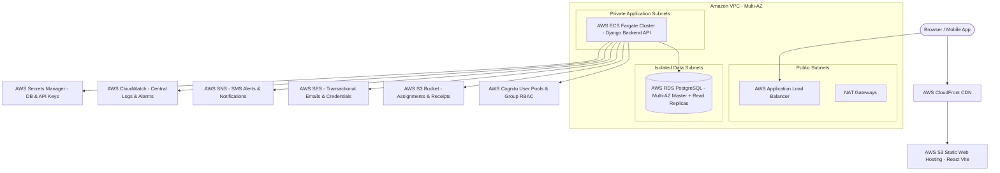

# AWS Cloud Architecture & Deployment Guide
## Production Coaching Institute CRM / ERP

This document outlines the step-by-step setup and deployment strategy for running the **Coaching Institute CRM** on AWS Managed Infrastructure for multi-branch scalability serving thousands of concurrent students, teachers, parents, and administrative staff.

---

## 1. High-Level AWS Architecture Diagram



---

## 2. AWS Managed Services Configuration

### A. AWS RDS PostgreSQL (Multi-AZ)
1. **DB Engine**: PostgreSQL 16.2.
2. **Instance Class**: `db.m6g.xlarge` (Production) or `db.t4g.medium` (Staging).
3. **Database Name**: `Institute_CRM`
4. **Master Username**: `postgres`
5. **Security Group**: Inbound TCP Port 5432 permitted **ONLY** from ECS Application Security Group.

### B. AWS Cognito User Pools
1. Create a User Pool named `InstituteCRM-UserPool`.
2. Configure Sign-in attributes: `Email` and `Username`.
3. Create 8 Cognito User Groups corresponding to RBAC roles:
   - `SUPER_ADMIN`
   - `BRANCH_ADMIN`
   - `ADMISSION_COUNSELOR`
   - `TEACHER`
   - `STUDENT`
   - `PARENT`
   - `ACCOUNTANT`
   - `RECEPTIONIST`
4. Export `AWS_COGNITO_USER_POOL_ID` and `AWS_COGNITO_APP_CLIENT_ID`.

### C. AWS S3 Storage
1. Create S3 Bucket `institute-crm-storage-bucket`.
2. Enable Default Server-Side Encryption (KMS).
3. Configure CORS policy for direct frontend presigned uploads:
```json
[
  {
    "AllowedHeaders": ["*"],
    "AllowedMethods": ["GET", "PUT", "POST", "DELETE"],
    "AllowedOrigins": ["https://crm.yourinstitute.com"],
    "ExposeHeaders": ["ETag"]
  }
]
```

### D. AWS SES & SNS Notifications
1. Verify domain `yourinstitute.com` in AWS SES Console.
2. Configure DKIM & SPF DNS records.
3. Export `AWS_SES_SENDER_EMAIL=no-reply@yourinstitute.com`.
4. Create SNS Topic `arn:aws:sns:us-east-1:123456789012:InstituteNotifications`.

### E. AWS Secrets Manager & CloudWatch
1. Store Database Credentials & Django Secret Key in Secret `production/institute_crm/secrets`.
2. Attach IAM Role to ECS Task Execution Role with `secretsmanager:GetSecretValue` and `logs:PutLogEvents`.

---

## 3. Deployment Commands

### Local Docker Testing
```bash
# Clone repository and navigate to root directory
cd institute_crm

# Build and start all services (PostgreSQL, Django Backend, React Frontend)
docker-compose up --build -d

# Check health of containers
docker-compose ps

# Access services:
# React Web App: http://localhost
# Django API & Swagger Docs: http://localhost:8000/api/docs/
```

### Production AWS ECS Deployment
```bash
# 1. Login to AWS ECR
aws ecr get-login-password --region us-east-1 | docker login --username AWS --password-stdin <AWS_ACCOUNT_ID>.dkr.ecr.us-east-1.amazonaws.com

# 2. Build & Push Backend Docker Image
docker build -t institute-crm-backend -f Dockerfile.backend .
docker tag institute-crm-backend:latest <AWS_ACCOUNT_ID>.dkr.ecr.us-east-1.amazonaws.com/institute-crm-backend:latest
docker push <AWS_ACCOUNT_ID>.dkr.ecr.us-east-1.amazonaws.com/institute-crm-backend:latest

# 3. Build & Push Frontend Docker Image
cd frontend
docker build -t institute-crm-frontend -f Dockerfile.frontend .
docker tag institute-crm-frontend:latest <AWS_ACCOUNT_ID>.dkr.ecr.us-east-1.amazonaws.com/institute-crm-frontend:latest
docker push <AWS_ACCOUNT_ID>.dkr.ecr.us-east-1.amazonaws.com/institute-crm-frontend:latest
```

---

## 4. Default Seed Credentials (Post-Deployment)

All accounts are pre-seeded with password: `Admin@123`

| Role | Username | Email |
| :--- | :--- | :--- |
| **Super Admin** | `admin` | `admin@coachinginstitute.com` |
| **Branch Admin** | `branchadmin` | `badmin@coachinginstitute.com` |
| **Admission Counselor** | `counselor` | `counselor@coachinginstitute.com` |
| **Teacher** | `teacher` | `teacher@coachinginstitute.com` |
| **Student** | `student` | `student@coachinginstitute.com` |
| **Parent** | `parent` | `parent@coachinginstitute.com` |
| **Accountant** | `accountant` | `accountant@coachinginstitute.com` |
| **Receptionist** | `receptionist` | `reception@coachinginstitute.com` |
