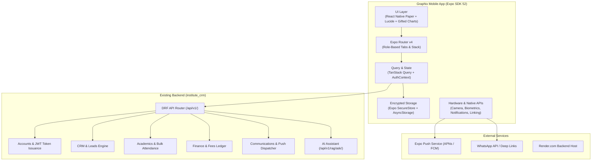
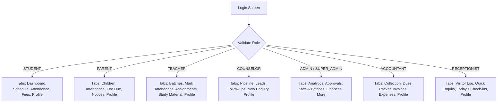
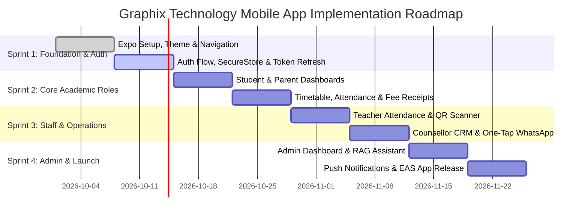

# Graphix Technology Mobile Application — Implementation Plan

**Client / Institute:** Graphix Technology  
**Architecture:** Cross-Platform Mobile Client (iOS & Android) with Existing Django REST Backend  
**Document Type:** Technical Architecture & Implementation Plan  
**Target Platform:** React Native + Expo (SDK 52+ / New Architecture)  
**Author:** Antigravity AI Engineering  

---

## 1. Executive Summary & Tech Stack Evaluation

The objective is to build a high-performance, responsive cross-platform mobile application for **Graphix Technology**, delivering functional and visual parity with the existing web CRM while harnessing native mobile superpowers (push notifications, camera/QR scanning, WhatsApp one-tap messaging, and biometric authentication).

### 1.1 Tech Stack Verdict: React Native + Expo vs. Alternatives

The user proposed building the mobile app with **React Native and Expo**. Below is an objective architectural evaluation comparing this choice with other mobile approaches:

| Dimension | React Native + Expo (Recommended) | Flutter (Dart) | Capacitor / Ionic (WebView) | Native (Swift + Kotlin) |
| :--- | :--- | :--- | :--- | :--- |
| **Logic & Skillset Reuse** | **Maximum (90%)**: Direct reuse of JS/TS patterns, axios interceptors, auth flows, and React state paradigms. | **Low (0%)**: Requires rewriting everything in Dart; context and hooks cannot be ported. | **Maximum (95%)**: Wraps web code in a native WebView shell. | **Zero (0%)**: Two separate teams and native languages. |
| **UI/UX & Native Feel** | **Native 60–120 FPS**: Real native controls, gestures, and fluid transitions. | **Native 60–120 FPS**: Skia/Impeller engine; great look, but custom widget styling. | **Poor / "Webby"**: Janky scrolling with large lists, laggy mobile keyboard, no native touch response. | **Best**: Pure OS controls. |
| **Development Velocity** | **Very Fast**: Expo Router, Expo Go, Fast Refresh, and Over-The-Air (OTA) updates. | **Moderate**: Fast refresh, but separate tooling and no existing codebase overlap. | **Fast initial**, but debugging native plugins and WebView quirks drains time. | **Slow**: Two codebases to build and maintain in parallel. |
| **Push Notifications & Hardware** | **Turnkey**: `expo-notifications`, `expo-camera`, `expo-secure-store`, `expo-local-authentication`. | **Good**: Well-supported native plugins. | **Mediocre**: Relies on Cordova/Capacitor bridge plugins that often lag OS updates. | **Full native access**. |
| **Store Delivery & CI/CD** | **EAS (Expo Application Services)**: Cloud builds for iOS & Android without requiring a Mac locally. | Requires local Xcode/Mac for iOS builds or self-managed CI/CD pipelines. | Requires manual Xcode/Android Studio maintenance. | Separate native build pipelines. |

> [!TIP]
> **Final Recommendation:** **React Native with Expo (SDK 52+ with Expo Router v4)** is unequivocally the superior choice. It lets you preserve your existing React investment, share business logic and API contracts directly with the Django backend, and deliver a smooth 60fps native experience without maintaining two separate codebases.

---

## 2. Architecture & Integration Strategy



### 2.1 Backend Connectivity & Contract Alignment
The mobile application will connect directly to the existing Django REST Framework backend (`institute_crm`):
- **Base URLs:**
  - Local Development: `http://<LAN_IP>:8000/api/v1` (with physical device via Expo) or `http://10.0.2.2:8000/api/v1` (Android Emulator).
  - Production: `https://coaching-institute-crm.onrender.com/api/v1`.
- **Envelope Handling:** The mobile API service will reuse the existing `unwrapData` and `unwrapList` parsing logic from the web frontend's [api.js](file:///d:/CRM%20project/CRM/institute_crm/frontend/src/services/api.js):
  ```typescript
  // Response structure: { success: boolean, data: T, message?: string }
  export const unwrapData = (res: any) => res?.data?.data ?? res?.data ?? res;
  ```
- **Cold Boot Handling:** Keep the `/healthz/` pre-warming ping on the app's splash/login screen so that dormant Render instances spin up transparently while the user enters credentials.

### 2.2 Token Storage & Persistent Sessions
On the web, authentication tokens live in browser `localStorage`. On mobile, security and session persistence require native storage:
- **`expo-secure-store`**: Used to store the JWT `access_token` and `refresh_token` with hardware-backed encryption (iOS Keychain / Android Keystore).
- **Auto-Refresh Interceptor**: When an API call returns `401 Unauthorized`, an Axios interceptor catches it, uses the stored `refresh_token` to fetch a fresh `access_token`, updates `SecureStore`, and transparently replays the failed request without interrupting the user.
- **Biometric Unlock**: Quick biometric authentication (Face ID / Fingerprint via `expo-local-authentication`) allows users to re-open the app instantly without entering passwords every time.

---

## 3. Frontend Parity & Mobile UI/UX Redesign

The web frontend uses `@mui/material` (Material UI v6), Lucide icons, and a custom dark/light theme configured in [theme.js](file:///d:/CRM%20project/CRM/institute_crm/frontend/src/theme/theme.js).

### 3.1 Design System & Theme Mapping
To preserve the **Graphix Technology** brand identity:
- **UI Framework:** **React Native Paper (v5 MD3)** combined with **NativeWind v4** (Tailwind for React Native). This allows utilizing Material 3 components that map 1:1 with Material UI, while using utility classes for rapid layout adjustments.
- **Brand Palette:**
  - `primary`: `#6366F1` (Indigo 500) / `#4F46E5` (Indigo 600)
  - `secondary` / `success`: `#10B981` (Emerald 500)
  - `background`: Dark `#0F172A` (Slate 900) / Light `#F8FAFC`
  - `surface` / `card`: Dark `#1E293B` (Slate 800) / Light `#FFFFFF`
  - `warning`: `#F59E0B` (Amber) | `error`: `#EF4444` (Rose)
- **Typography:** **Plus Jakarta Sans** and **Inter** loaded via `expo-font` / `@expo-google-fonts`.
- **Icons:** `lucide-react-native` provides exact 100% visual parity with the web's `lucide-react`.
- **Data Visualizations:** Replace `react-chartjs-2` with `react-native-gifted-charts` for 60fps gesture-driven donut charts (fee collection), bar charts (batch attendance), and line charts (revenue trends).

### 3.2 Transforming Web Patterns to Mobile Patterns

| Web Pattern (Current Desktop CRM) | Mobile Equivalent Pattern | Mobile Benefit |
| :--- | :--- | :--- |
| **Dense Data Tables** (Leads, Students, Invoices) | **Virtualized Card Lists (`FlashList`)** with status badges, search bars, and swipe actions. | Natural thumb scrolling, no horizontal scroll exhaustion. |
| **Desktop Modals & Popups** | **Bottom Sheets (`@gorhom/bottom-sheet`)** with drag handle. | Single-hand ergonomic reachability on modern large smartphones. |
| **Permanent 260px Left Sidebar** | **Bottom Tab Bar** (4-5 primary role actions) + **Floating Action Button (FAB)** + **Drawer / "More" Menu**. | Maximizes screen real estate for content. |
| **Multi-column Forms** | **Step-by-step Multi-step Wizards** with sticky bottom CTA. | Prevents keyboard occlusion and improves mobile completion rates. |
| **Manual Refresh Button** | **Pull-to-Refresh (`RefreshControl`)** on all list feeds. | Standard native mobile expectation. |

---

## 4. Role-Based Mobile Navigation & Workflows

The system serves **8 distinct personas** derived from `user.role_code` returned by `AuthService.login`. Upon authentication, the mobile app dynamically switches the root navigation layout to match the active persona:



### 4.1 Student Experience
- **Home Dashboard:** Attendance meter (radial gauge), upcoming lecture countdown, pending fees alert banner, latest test marks.
- **Timetable:** Day-by-day swipeable calendar showing room, teacher, and subject.
- **Attendance:** Monthly breakdown, present/absent stats, and eligibility threshold warnings.
- **Fees & Receipts:** Total fees, paid amount, installments due, with a "Download Receipt" button that triggers `expo-sharing` to share PDF receipts via WhatsApp.
- **Assignments:** View open assignments, download attached documents, upload homework photo from camera/gallery.

### 4.2 Parent Experience
- **Multi-Child Switcher:** Seamlessly toggle between siblings enrolled in different batches.
- **Real-time Notifications:** Instant alerts when child is marked absent or arrives late.
- **Fee Payment & Dues:** Summary of pending installments with due dates and payment link buttons.
- **Academic Progress:** Exam scorecards, faculty remarks, and syllabus completion meters.

### 4.3 Teacher Experience
- **Today's Classes:** List of scheduled lectures with room allocation and start times.
- **One-Tap Attendance Marking:** High-speed bulk marking screen:
  - Defaults all students to "Present".
  - One-tap toggle to mark "Absent" or "Late".
  - Haptic feedback on tap (`expo-haptics`).
  - "Submit All" triggers `POST /api/v1/academics/lectures/{id}/bulk-attendance/`.
- **QR Code Attendance:** Teacher displays a generated batch QR code, or uses the phone camera to scan student ID cards.
- **Study Materials:** Upload notes or PDF syllabus directly from device storage.

### 4.4 Admission Counsellor Experience
- **Mobile CRM Pipeline:** Leads grouped by stage (*New Enquiry, Contacted, Demo Scheduled, Converted*).
- **One-Tap Lead Engagement:**
  - Direct Phone Call: `Linking.openURL('tel:+91...')`.
  - Direct WhatsApp Message: `Linking.openURL('whatsapp://send?phone=+91...&text=Hello...')` with pre-filled counselling templates.
- **Quick Lead Capture:** Floating Action Button (FAB) on all screens to register walk-ins or phone enquiries in under 30 seconds.
- **Follow-up Reminders:** Calendar-linked notifications for scheduled demo lectures and callbacks.

### 4.5 Super Admin & Branch Admin Experience
- **Executive KPI Dashboard:** Real-time revenue figures, month-to-date admissions, student-teacher ratios, and daily attendance percentages.
- **Branch Switcher:** Switch between branches (e.g., Pune Main, Delhi North) to view filtered statistics.
- **Urgent Approvals:** Quick approvals for fee discounts, batch transfers, and staff leaves.

---

## 5. Mobile-Specific Superpowers (Beyond the Web App)

Building a mobile application provides unique capabilities that significantly elevate the institute's operations over a browser experience:

```
┌────────────────────────────────────────────────────────────────────────┐
│                      MOBILE-NATIVE ADVANTAGES                         │
├────────────────────────────────┬───────────────────────────────────────┤
│ 1. Push Notifications (Expo)   │ Instant fee reminders, schedule       │
│                                │ changes, and emergency holiday alerts │
├────────────────────────────────┼───────────────────────────────────────┤
│ 2. WhatsApp & Phone Linking    │ One-tap lead follow-up for            │
│                                │ counsellors & receptionists           │
├────────────────────────────────┼───────────────────────────────────────┤
│ 3. Camera & QR Scanning        │ Lightning-fast student check-in and   │
│                                │ assignment photo submissions          │
├────────────────────────────────┼───────────────────────────────────────┤
│ 4. Biometric App Lock          │ FaceID/Fingerprint for instant,       │
│                                │ secure authentication                 │
├────────────────────────────────┼───────────────────────────────────────┤
│ 5. Offline Cache & SQLite      │ Offline timetable and student roster  │
│                                │ viewing during connectivity drops     │
├────────────────────────────────┼───────────────────────────────────────┤
│ 6. Native PDF Sharing          │ Share fee receipts & report cards     │
│                                │ directly via WhatsApp/AirDrop         │
└────────────────────────────────┴───────────────────────────────────────┘
```

1. **Expo Push Notifications:**
   - Integrated with APNs (iOS) and FCM (Android).
   - Sends notifications even when the app is killed (e.g., "Batch 101 rescheduled to 4:00 PM", "Fee due reminder for installment 2").
2. **One-Tap WhatsApp & Calling Integration:**
   - Counsellors can tap a lead card to immediately open WhatsApp with a tailored enquiry response, eliminating the manual friction of saving numbers to contacts.
3. **Offline Caching with TanStack Query:**
   - Today's lectures, timetable, and student lists are cached locally.
   - Teachers in basements or low-signal classrooms can still record attendance offline, which syncs automatically as soon as internet connectivity resumes.
4. **AI Assistant Floating Action Widget:**
   - Mobile port of `RagAssistantWidget.jsx` into a native bottom sheet.
   - Students and staff can query the institute's knowledge base (`/api/v1/rag/ask/`) to ask questions like *"What is the syllabus for next week's Python test?"* or *"What are the institute's fee refund guidelines?"*.

---

## 6. Backend Enhancements Required for Mobile

The existing backend is 95% mobile-ready. Only three minimal, high-value additions are recommended in `institute_crm/`:

### 6.1 Token Refresh Endpoint
*Current State:* The backend issues an access token and refresh token upon login, but does not expose a standard refresh URL in `accounts/urls.py`.  
*Required Change:* Register DRF SimpleJWT's `TokenRefreshView`:
```python
# In institute_crm/accounts/urls.py:
from rest_framework_simplejwt.views import TokenRefreshView

urlpatterns += [
    path('auth/token/refresh/', TokenRefreshView.as_view(), name='token_refresh'),
]
```
*Impact:* Allows mobile users to stay logged in indefinitely without re-entering credentials when their 60-minute access token expires.

### 6.2 Push Notification Device Token Model & Endpoint
*Required Addition:* Create a lightweight `DeviceToken` model in `communications` to store mobile push tokens:
```python
# In institute_crm/communications/models.py:
class DeviceToken(models.Model):
    user = models.ForeignKey(settings.AUTH_USER_MODEL, on_delete=models.CASCADE, related_name='device_tokens')
    expo_push_token = models.CharField(max_length=255, unique=True)
    platform = models.CharField(max_length=20, choices=[('ios', 'iOS'), ('android', 'Android')])
    updated_at = models.DateTimeField(auto_now=True)

# Endpoint: POST /api/v1/communications/devices/register/
```

### 6.3 Student ID Barcode/QR Generation
*Enhancement:* Expose student QR payloads (e.g., `graphix://student/{enrollment_no}`) via the existing student profile API so mobile devices can scan and identify students in real-time.

---

## 7. Recommended Mobile Project Structure

The project will be organized using **Expo Router v4** inside a dedicated directory (or monorepo workspace `mobile/`):

```
graphix-mobile/
├── app/                             # Expo Router file-based navigation
│   ├── (auth)/                      # Authentication stack
│   │   ├── login.tsx                # Phone / Username login
│   │   ├── forgot-password.tsx      # OTP & reset password
│   │   └── _layout.tsx
│   ├── (app)/                       # Authenticated layout with role guard
│   │   ├── _layout.tsx              # Root session validator
│   │   ├── (student)/               # Student tabs & screens
│   │   │   ├── (tabs)/
│   │   │   │   ├── index.tsx        # Dashboard
│   │   │   │   ├── schedule.tsx     # Timetable
│   │   │   │   ├── attendance.tsx   # Detailed attendance
│   │   │   │   ├── fees.tsx         # Ledger & receipts
│   │   │   │   └── profile.tsx
│   │   │   └── _layout.tsx
│   │   ├── (teacher)/               # Teacher tabs & screens
│   │   │   ├── (tabs)/
│   │   │   │   ├── index.tsx        # Today's batches
│   │   │   │   ├── attendance.tsx   # Fast attendance marker
│   │   │   │   ├── assignments.tsx  # Create & grade
│   │   │   │   └── profile.tsx
│   │   │   └── _layout.tsx
│   │   ├── (counselor)/             # Counsellor pipeline & leads
│   │   │   ├── (tabs)/
│   │   │   │   ├── index.tsx        # Leads kanban/list
│   │   │   │   ├── followups.tsx    # Scheduled calls
│   │   │   │   └── new-lead.tsx     # Quick entry form
│   │   │   └── _layout.tsx
│   │   └── (admin)/                 # Super Admin & Branch Admin
│   ├── modal/                       # Global overlays
│   │   ├── rag-assistant.tsx        # AI Help Assistant Bottom Sheet
│   │   └── qr-scanner.tsx           # Camera QR attendance scanner
│   ├── _layout.tsx                  # App root with ThemeProvider & QueryClientProvider
│   └── index.tsx                    # Splash & routing director
├── src/
│   ├── api/                         # Axios instance, endpoints, query hooks
│   │   ├── client.ts                # Axios + SecureStore interceptors
│   │   ├── auth.api.ts              # Login, me, token refresh
│   │   ├── leads.api.ts             # Leads & followups
│   │   ├── academics.api.ts         # Batches, lectures, attendance
│   │   └── finance.api.ts           # Fees, dues, payments
│   ├── components/                  # Reusable native components
│   │   ├── common/                  # Buttons, Inputs, Cards, BottomSheets
│   │   ├── charts/                  # GiftedCharts wrappers (Revenue, Attendance)
│   │   ├── leads/                   # LeadCard with swipe-to-call/WhatsApp
│   │   └── attendance/              # QuickToggleAttendanceRow
│   ├── constants/                   # Brand colors, typography, API URLs
│   ├── context/                     # AuthContext, NotificationContext
│   ├── hooks/                       # useAuth, useDebounce, useNetworkStatus
│   └── types/                       # Shared TypeScript interfaces (matching DRF)
├── assets/                          # App icons, splash screens, fonts
├── app.json                         # Expo configuration (bundle ID, permissions)
├── package.json
└── tsconfig.json
```

---

## 8. Implementation Roadmap & Milestones

An **8-week implementation timeline** organized into 4 agile sprints, delivering working increments at every stage:



### Sprint 1 (Weeks 1–2): Foundation & Authentication
- Initialize Expo project with TypeScript, Expo Router v4, and React Native Paper.
- Port Graphix brand styling (colors, Plus Jakarta Sans, dark/light modes) into native tokens.
- Implement `SecureStore` token handling, login screen, cold-boot Render pre-warming, and backend `/auth/token/refresh/` integration.
- Implement biometric unlock (Face ID / Fingerprint).

### Sprint 2 (Weeks 3–4): Student & Parent Experience
- Build Student Dashboard: KPI cards (attendance %, enrolled batch, pending dues, recent grades).
- Timetable & lecture schedule with swipeable day calendar.
- Detailed Attendance ledger with present/absent counts.
- Finance tab: Fee structure, transaction history, and one-tap PDF receipt downloading/sharing.
- Parent multi-child toggle and academic report viewing.

### Sprint 3 (Weeks 5–6): Faculty & Counsellor Operations
- Build Teacher Class Schedule & batch lists.
- Rapid bulk attendance marking screen with vibration feedback.
- Camera QR scanner integration for student card check-ins.
- Counsellor Lead Pipeline: Filterable cards with swipe-to-call and one-tap WhatsApp pre-filled messaging.
- New lead capture modal with instant validation.

### Sprint 4 (Weeks 7–8): Admin Analytics, Push Notifications & Deployment
- Executive Super Admin & Branch Admin analytics dashboards with `react-native-gifted-charts`.
- Mobile port of AI Knowledge Assistant (`RagAssistantWidget`) via bottom-sheet chat.
- Integrate `expo-notifications`: Register device push tokens on backend and dispatch notifications for fee reminders and batch rescheduling.
- Configure EAS Build (`eas.json`), prepare app store assets (icons, splash screens), and distribute internal testing builds via TestFlight and Google Play Internal Testing.

---

## 9. Build, Testing & App Store Distribution Strategy

### 9.1 Development & Internal Testing
- **Expo Go:** Immediate live testing during development by scanning the terminal QR code on any iPhone or Android phone.
- **Development Builds (`expo-dev-client`):** Custom native builds containing hardware plugins (Camera, Push, LocalAuthentication).
- **Over-The-Air (OTA) Updates (`eas update`):** Deploy instant JS fixes to staff and students in production without waiting for app store reviews.

### 9.2 Store Publishing (Google Play & Apple App Store)
- **EAS Build:** Cloud-based automated build pipeline producing:
  - Android: `.aab` (Android App Bundle) optimized for Google Play.
  - iOS: `.ipa` signed with Apple Developer certificates.
- **Zero Local Mac Dependency:** EAS compiles iOS binaries directly in the cloud, allowing developers on Windows to deploy fully compliant iOS apps.

---

## 10. Key Decisions & Next Steps

> [!IMPORTANT]
> **Summary of Key Decisions:**
> 1. **Framework:** **React Native with Expo** is chosen for maximum velocity, complete logic sharing with the current React web app, native 60fps performance, and effortless cloud builds.
> 2. **Backend:** Reuses the existing Django REST Framework API without architectural rewrites; only adds token refresh and device push token registration.
> 3. **Design:** Recreates the modern dark/light Plus Jakarta Sans theme using **React Native Paper + NativeWind** and **Lucide** icons.
> 4. **Delivery:** Phased 8-week rollout starting with Student & Teacher core flows, followed by Counsellor CRM and Admin analytics.

### Suggested Immediate Next Steps
1. **Review and approve this implementation plan.**
2. **Execute Phase 0 Setup:** Create the Expo project (`npx create-expo-app@latest -t tabs`) within the repository or as a companion mobile workspace.
3. **Add the Token Refresh Route:** Add `TokenRefreshView` to `institute_crm/accounts/urls.py` to enable persistent mobile sessions.
