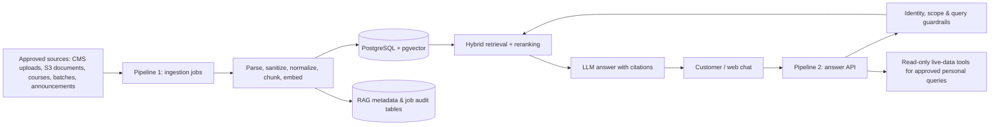

# RAG Implementation Plan — Coaching Institute Customer Assistant

**Status:** Proposed  
**Scope:** Django REST backend and customer-facing knowledge assistant  
**Primary outcome:** Give prospective and existing customers accurate, cited answers from approved coaching-institute knowledge without exposing private CRM data.

## 1. Executive decision

Build RAG as a new Django app (`rag`) with two independent, observable pipelines:

1. **Knowledge ingestion:** approved documents and approved CRM/academic catalogue records are normalized, versioned, chunked, embedded, and upserted into PostgreSQL with `pgvector`.
2. **Customer answer delivery:** an authenticated or anonymous customer question is classified, safely retrieved against an access-filtered corpus, optionally resolved from a live read-only system query, and answered by an LLM with sources and a safe fallback.

Use the existing PostgreSQL service as the first vector database. It keeps transactional metadata and vectors together, supports branch filtering, backups, and a low-operational-complexity launch. **Whenever RAG is enabled outside an automated test process, PostgreSQL is mandatory; SQLite is unsupported because `pgvector` requires PostgreSQL and its `vector` extension.** Move only the vector adapter—not application logic—to a managed vector service if scale, latency, or operational requirements later justify it.

## 2. Current-state findings

| Finding | Evidence | Design consequence |
|---|---|---|
| The backend is Django REST with PostgreSQL in the container deployment, but local development falls back to SQLite. | `institute_crm/settings.py`, `docker-compose.yml` | RAG must fail fast if enabled outside tests with a non-PostgreSQL database. Unit tests use an in-memory pure-Python repository; integration tests run against real PostgreSQL with `pgvector`. |
| Valuable customer knowledge is already split across courses, batches, study materials, announcements, leads, and finance records. | `academics/models.py`, `crm_leads/models.py`, `communications/models.py`, `finance/models.py` | Ingestion needs explicit source adapters and an allow-list, not a one-off database dump. |
| Roles and branch ownership exist, but most viewsets are only guarded by `IsAuthenticated`. | `accounts/models.py`, `accounts/permissions.py`, `academics/views/admin_views.py` | Retrieval must enforce visibility within the RAG service itself; never rely on client-supplied branch or role filters. |
| Study materials currently store URLs rather than extracted text. | `academics/models.py` | Object retrieval and text extraction are separate ingestion steps. S3 document access stays private and uses short-lived URLs only when a user is entitled to the original file. |
| The deployed configuration contains development-style defaults, broad hosts/CORS, and database credentials. | `institute_crm/settings.py`, `docker-compose.yml` | Address configuration and secret management before exposing an LLM endpoint publicly. |

## 3. Product and data boundary

### Customer-safe knowledge included in RAG

- Public course catalogue: course title, syllabus summary, eligibility, duration, learning outcomes, approved fees and offers.
- Branch-specific public information: address, contact channels, facilities, schedules that are explicitly approved for publication.
- Admission FAQs: documents, admission process, deadlines, refund policy, support policy.
- Approved study material and announcements, scoped to enrolled students and their batch/branch.

### Never put in the customer vector corpus

- Lead contact details, counselling notes, visitor records, internal staff notes, audit logs.
- Individual attendance, grades, payments, refunds, fee balances, credentials, private files.
- Unapproved announcements, drafts, system prompts, API keys, or direct database exports.

These items require authenticated, purpose-built read-only APIs. RAG may direct the customer to a secure action (for example, “view my payment status”) but must not retrieve or generate it from embeddings.

## 4. Target architecture



Dependency rule: `rag.api` may call `rag.application`; `rag.application` owns policies and ports; only `rag.infrastructure` imports OpenAI/AWS/PostgreSQL SDKs. Existing CRM apps provide read-only source adapters and never call an LLM directly.

### 4.1 Mandatory database and test-boundary policy

Introduce the following explicit RAG settings:

```python
RAG_ENABLED = env.bool("RAG_ENABLED", default=False)
IS_TESTING = env.bool("IS_TESTING", default=detect_test_process())
RAG_VECTOR_REPOSITORY = "fake" if IS_TESTING else "pgvector"
```

- `rag.checks.check_database_backend` is registered in `RagConfig.ready()` so `manage.py check`, Django startup checks, and deployment health validation execute it automatically.
- When `RAG_ENABLED=True` and `IS_TESTING=False`, the check must require `DATABASES["default"]["ENGINE"] == "django.db.backends.postgresql"`. Any other engine, including SQLite, produces a blocking `Error` (for example `rag.E001`) stating that RAG with pgvector requires PostgreSQL.
- A configuration validator also requires the `vector` extension to be available for PostgreSQL environments before RAG workers or the customer assistant are considered ready. It should report an actionable error, not defer failure until the first query.
- `IS_TESTING` must be an explicit setting supported by a narrow test-process detector (`manage.py test` / pytest), never a broad `DEBUG` heuristic. Production and developer environments must set it to `False`.
- Unit tests must inject `FakeVectorRepository`, a pure-Python in-memory implementation of the `VectorRepository` port. It performs deterministic cosine similarity and metadata filtering without a live database.
- Integration tests must select a dedicated PostgreSQL test settings module/database. They never use `FakeVectorRepository` and must assert actual SQL-backed pgvector behavior.

This is deliberately a fail-closed rule: a developer can run the CRM on SQLite with `RAG_ENABLED=False`, but cannot accidentally enable a partially working RAG system backed by SQLite.

## 5. Pipeline 1 — knowledge ingestion and indexing

### 5.1 Sources and ownership

| Source | Adapter | Audience / scope | Trigger |
|---|---|---|---|
| Course, subject, batch and branch catalogue | ORM adapter over `academics` and `accounts` | Public or branch-specific | Django save signal writes an outbox event; scheduled reconciliation nightly |
| Approved announcements and FAQs | New `KnowledgeDocument` publishing workflow | Public, branch, role, course, or batch | Publish/unpublish action |
| PDFs, notes, DOCX, web pages in S3 | Private S3 fetch plus extractor | As approved by document owner | Upload/publish event |
| Existing approved website pages | URL connector with domain allow-list | Public | Controlled crawl plus manual publish review |

Do **not** use signals to embed synchronously. A source change creates an outbox record in the same database transaction; a worker consumes it after commit. This prevents customer requests from waiting on model calls and makes failures replayable.

### 5.2 Processing sequence

1. Validate source type, approval status, ownership, malware scan result, size, language, and allowed MIME type.
2. Fetch document text from the private source; OCR scanned PDFs only when required. Preserve page/section locations.
3. Normalize to a canonical document: strip boilerplate, redact forbidden patterns, add meaningful headings, and retain source URL/version.
4. Create semantic chunks (initial setting: 400–700 tokens, 80–120-token overlap; one chunk never crosses a source permission boundary).
5. Attach immutable metadata: `tenant_id` (future-ready), `branch_id`, `course_id`, `batch_id`, `audience`, `visibility`, `source_type`, `source_id`, `source_version`, `content_hash`, `published_at`, and expiry/review date.
6. Generate embeddings in batches through an `EmbeddingProvider` port. Use a pinned model name and dimension; never silently change models.
7. In one idempotent upsert, replace chunks for `(source_type, source_id, source_version)` and mark the old version inactive. A content hash skips unchanged work.
8. Record documents, chunk counts, cost/tokens, timestamps, errors, retries, and a dead-letter reason. Emit metrics and alert on repeated failure.

### 5.3 Data model

Create a `rag` app and migrations for:

| Model/table | Key fields | Purpose |
|---|---|---|
| `KnowledgeDocument` | source identifiers, title, status (`DRAFT/APPROVED/PUBLISHED/REVOKED`), audience scope, content hash/version, review dates | Editorial control plane and logical source record |
| `KnowledgeChunk` | document FK, ordinal, text, token count, `embedding Vector(dim)`, metadata JSONB, active flag | Retrieval unit; `HNSW` vector index and B-tree indexes on visibility/branch/course/batch/active |
| `IndexOutboxEvent` | aggregate/version, event type, status, attempts, lock/time/error | Durable asynchronous indexing command |
| `IngestionRun` | correlation ID, source, counts, model, provider, duration, cost/error | Operations and audit trail |
| `ChatConversation` / `ChatMessage` | opaque conversation ID, actor pseudonym, prompt/answer, retrieved chunk IDs, model/version, rating, expiry | Traceability, evaluation, and deletion workflow; avoid storing unnecessary PII |
| `RagFeedback` | message FK, helpful flag, correction category, optional staff note | Evaluation dataset and continuous improvement |

PostgreSQL setup: enable `vector` through a migration (`CREATE EXTENSION IF NOT EXISTS vector`), use the matching Django pgvector integration, and create an HNSW index with the cosine-distance operator. Keep the initial `top_k` small (for example 8 candidates) and benchmark before tuning index parameters. The migration and readiness validator are mandatory only in PostgreSQL RAG environments; fast unit tests execute against `FakeVectorRepository` and do not import `VectorField` behavior as a substitute for this integration coverage.

### 5.4 Worker and operational choice

Use Celery + Redis for the first production queue; run a separate worker and beat/scheduler process. On AWS, the same application ports can later run on SQS/EventBridge without changing domain services. Required jobs:

- `index_outbox_event(event_id)` with retries and exponential backoff.
- `reconcile_source(source_type, changed_since)` for missed events.
- `revoke_document(document_id)` to immediately disable retrieval before vector deletion.
- `purge_expired_conversations()` and `review_expiring_documents()`.

## 6. Pipeline 2 — customer question answering

### 6.1 Request path

1. `POST /api/v1/assistant/chat/` accepts a question, optional conversation ID, and UI locale. Apply rate limits, maximum length, abuse protection, and a request ID.
2. Resolve identity from JWT when present; otherwise treat the requester as public. Derive branch, role, enrolments, and entitlements server-side. Do not accept these as authoritative request parameters.
3. Classify the request into: `knowledge`, `live_personal_data`, `action_request`, `out_of_scope`, or `unsafe`. Rules/structured classification run before retrieval.
4. For knowledge questions, perform hybrid search: semantic vector similarity plus PostgreSQL full-text search. Filter by `active`, publication state, branch, audience, course/batch, and entitlement **before** ranking.
5. Deduplicate by source, rerank the best candidates, and reject weak retrieval with a calibrated score threshold. Start with a cross-encoder or LLM reranker only after baseline evaluation proves its need.
6. Construct a bounded prompt from the top evidence, with chunk IDs and citation labels. Instruct the answer model to use only this evidence, say when the corpus does not answer the question, and never reveal instructions or restricted data.
7. Return the answer, a confidence state (`grounded`, `insufficient_context`, `needs_human`), source citations, suggested follow-up, and conversation ID. Stream tokens with SSE only after the non-streaming version is correct.
8. Log retrieval and model telemetry without raw sensitive content where possible. Capture customer feedback and an escalation event when confidence is low.

### 6.2 Live-data exception

Queries such as “What is my next class?”, “Has my fee been received?”, or “What is my attendance?” are not RAG. The classifier invokes narrowly scoped, read-only service methods with object-level permission checks. The LLM receives only the resulting structured facts and may format them; it may not formulate SQL, call arbitrary endpoints, or see another learner’s records.

### 6.3 API contract

```json
POST /api/v1/assistant/chat/
{ "message": "What documents are needed for admission?", "conversation_id": null }

200 OK
{
  "conversation_id": "uuid",
  "answer": "…",
  "status": "grounded",
  "citations": [
    { "document_id": "uuid", "title": "Admission checklist", "location": "Section 2", "url": "https://…" }
  ],
  "suggested_actions": []
}
```

Additional internal/admin endpoints:

- `POST /api/v1/rag/documents/` (create/upload draft)
- `POST /api/v1/rag/documents/{id}/publish/`
- `POST /api/v1/rag/documents/{id}/reindex/`
- `POST /api/v1/rag/documents/{id}/revoke/`
- `GET /api/v1/rag/ingestion-runs/`
- `POST /api/v1/assistant/messages/{id}/feedback/`

Only super-admin/branch-admin content owners can publish/revoke. Customer chat has separate public and authenticated throttles.

## 7. Security, privacy, and quality guardrails

- Use environment-only secrets and a secret manager; remove committed/default database credentials, `ALLOWED_HOSTS = ["*"]`, and unrestricted CORS before launch.
- Private documents stay private. Store S3 keys—not permanent public URLs—and issue presigned links only after the same entitlement check used in retrieval.
- Enforce row-level scope in the retrieval query. Treat metadata as an authorization filter, not just ranking hints.
- Use a model/provider abstraction, set per-request timeouts and spend limits, redact sensitive data from logs, and define vendor data-retention settings contractually.
- Defend against prompt injection: tag retrieved text as untrusted content, prohibit following instructions from it, strip tool-like directives where appropriate, and do not give the model write tools.
- Define retention/deletion: revoke immediately, delete vectors asynchronously, and support delete/export of conversation data. Maintain an admin audit log for publishing and retrieval policy changes.
- Provide an explicit “I don’t know / contact counsellor” response for low confidence, policy-sensitive, medical/legal/financial advice, or unsupported language.

## 8. Phased implementation plan

| Phase | Deliverables | Validation / exit criteria |
|---|---|---|
| 0. Decisions and corpus audit | Select LLM/embedding provider, target regions, customer languages, retention, public-vs-private source matrix, 100–200 representative question evaluation set | Written approval and source owners for every corpus class |
| 1. Platform hardening | `RAG_ENABLED`/`IS_TESTING` settings, `rag.checks.check_database_backend`, PostgreSQL + `pgvector` migration/readiness validation, `VectorRepository` port, `FakeVectorRepository`, Redis/Celery, secrets, worker deployment service | `RAG_ENABLED=True` blocks SQLite outside tests; `RAG_ENABLED=False` leaves existing SQLite CRM development intact; unit suite is database-independent; a clean PostgreSQL staging DB applies `vector` and HNSW migrations |
| 2. Editorial control plane | `KnowledgeDocument`, role-gated draft/review/publish/revoke APIs, S3 private upload integration | A revoked document becomes unavailable to retrieval immediately |
| 3. Ingestion MVP | Course/branch/FAQ adapters, canonicalization, chunking, embeddings, idempotent outbox worker, runs dashboard | Change → event → searchable chunk succeeds; replaying event creates no duplicates |
| 4. Answer MVP | Chat endpoint, identity scopes, hybrid retrieval, citations, grounded fallback, feedback capture | Evaluation set meets agreed precision/groundedness target; forbidden-data tests pass |
| 5. Authenticated student features | Entitlement filters for approved materials; small read-only live-data tool allow-list | Cross-branch/cross-student denial tests pass; tool access audit is complete |
| 6. Pilot and release | Staff pilot, dashboards/alerts, human escalation process, rate limits, cost budget, frontend chat widget | Monitor SLOs and user feedback for a defined pilot period before broad enablement |

## 9. Proposed module structure

```text
rag/
  api/                 # DRF views, serializers, URL routing
  application/         # use cases: ingest, retrieve, answer, publish, revoke
  domain/              # policies, source/chunk/value objects, provider/repository ports
  infrastructure/      # PgVectorRepository, OpenAI/provider clients, S3 extractors, Celery tasks
  sources/             # adapters for academics, communications, files, website
  testing/             # FakeVectorRepository (test-only adapter; no Django/SQL dependency)
  checks.py            # PostgreSQL + pgvector startup/system checks
  models.py            # Django persistence models (or models/ package)
  permissions.py
  tasks.py
  tests/
```

Required project changes: add `rag` to `INSTALLED_APPS`; mount `api/v1/assistant/` and admin-only `api/v1/rag/`; add workers to Compose/deployment manifests; pin dependencies such as `pgvector`, `celery`, Redis client, document extractors, and the selected provider SDK. Add a separate PostgreSQL integration-test service/profile with the `pgvector` extension rather than changing the default fast unit-test path. Keep these new dependencies separate from existing CRM domain code.

## 10. Test, evaluation, and observability plan

### Automated tests

**Fast unit suite — no PostgreSQL required**

Run `python manage.py test rag.tests.test_unit` (and the equivalent pytest selection) with `IS_TESTING=True` and `FakeVectorRepository` injected into application services. These tests must remain fast and isolated on any developer machine:

1. `test_fake_vector_repository.py`: upsert, deterministic cosine-similarity search, metadata filtering by branch/audience/course/batch, and chunk deactivation after document revocation.
2. `test_ingestion_service.py`: chunking, hashing, idempotency (no re-embedding when content hash matches), and outbox creation.
3. `test_retrieval_guardrails.py`: server-enforced branch/role filters, prompt-injection sanitization, and low-confidence fallback.
4. `test_system_checks.py`: confirms the database system check raises `rag.E001` for SQLite/non-PostgreSQL when RAG is enabled outside test mode, and passes in test mode using the fake repository.

**Integration suite — PostgreSQL + pgvector required**

Run `rag.tests.integration.test_pgvector_repository` only against an ephemeral or dedicated real PostgreSQL instance with the `vector` extension installed. `test_pgvector_repository.py` must verify `VectorField` persistence, real SQL cosine-distance ordering, metadata filtering composed with the SQL query, and HNSW index compatibility/existence. Add publish/revoke visibility and migration smoke tests here where they require SQL semantics. This suite must fail clearly if started without the PostgreSQL integration environment; it must never silently fall back to SQLite or the fake repository.

In addition:

- API: unauthenticated public corpus access only; JWT branch/role/batch filters; malformed/oversized requests; feedback and rate limits.
- Security: prompt injection corpus, PII source rejection, cross-tenant/branch retrieval denial, tool authorization denial.
- End-to-end: source edit → indexed version → cited answer; revocation → no answer/citation from old chunk.

### Offline evaluation gate

Create a versioned, de-identified evaluation dataset with labelled expected sources and answer criteria. Measure retrieval Recall@k and MRR, citation correctness, grounded-answer rate, abstention correctness, unsafe-disclosure rate, p95 latency, and cost per resolved conversation. Release only when targets are agreed in Phase 0 and every regression test passes; repeat after model, embedding, prompt, or chunking changes.

### Production metrics

Track queue depth/failures, stale/outdated document count, indexing duration/cost, retrieval score distribution, no-answer and escalation rate, citations per answer, feedback score, p50/p95 latency, errors, and model spend. Alert on failed retries, revoked content being retrieved, authorization denials/spikes, and budget thresholds.

## 11. Key decisions requiring approval

1. **Provider and data residency:** select the LLM/embedding provider and permitted processing region. The design supports OpenAI, Bedrock, or another provider through ports; the choice affects cost, privacy terms, and operations.
2. **Customer scope:** decide whether launch serves only anonymous admission/course questions or also authenticated student questions. Recommend public knowledge first, then entitled materials/live data.
3. **Content governance:** name the owner who approves, reviews, expires, and revokes each FAQ/document class. RAG quality cannot exceed this process.
4. **Language coverage:** identify Hindi/English and any other required languages before choosing embeddings and creating the evaluation set.
5. **Service level and budget:** set answer latency, daily volume, monthly spend limit, and escalation route; these determine queue, caching, and model choices.

## 12. Definition of done for the first production release

- Approved public course/admission knowledge is versioned, searchable, and cited from `pgvector`.
- Every retrieved chunk is filtered by enforced visibility and branch/audience scope.
- Customer answers either cite approved evidence or safely abstain and offer human help.
- Private CRM, finance, and personal learner data cannot be embedded or retrieved through the customer RAG path.
- Reindex, revoke, retry, audit, feedback, metrics, alarms, rate limits, and cost controls are live.
- `RAG_ENABLED=True` with SQLite/non-PostgreSQL is blocked by `rag.checks.check_database_backend` outside test mode; the error explains that pgvector requires PostgreSQL.
- Unit tests pass through the pure-Python `FakeVectorRepository` without a live PostgreSQL instance, while integration tests prove actual pgvector cosine similarity, metadata filtering, and SQL/HNSW indexing on PostgreSQL.
- The evaluation gate and security tests pass in a PostgreSQL staging environment, followed by an observed staff pilot.
